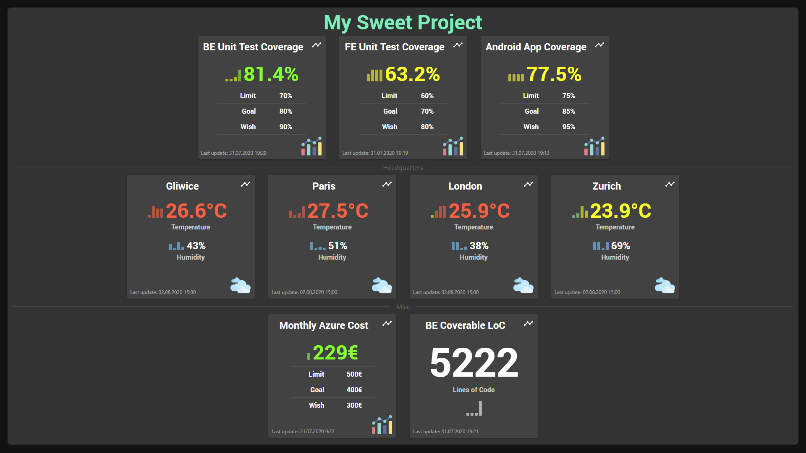
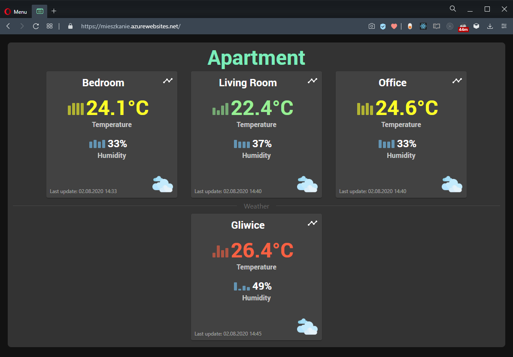
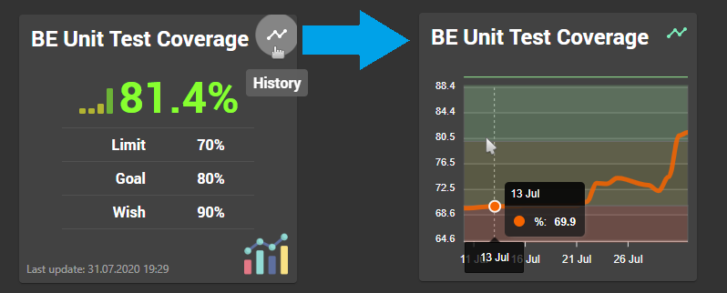
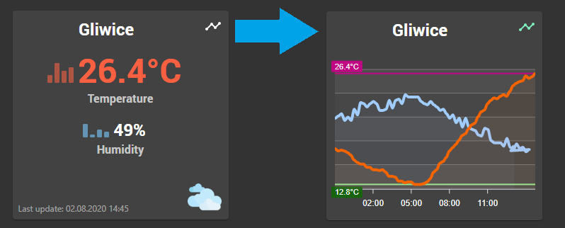
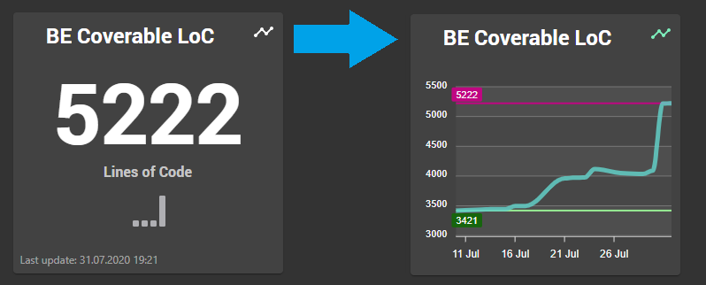
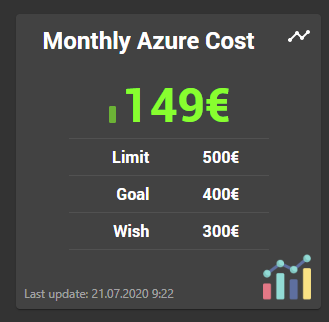
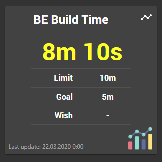

# TilesDashboard.Backend

# Overview

Purpose of Tiles Dashboard is to display various information about e.g. a project, home etc. as **Tiles**

## Features

- Update tiles data via endpoints
- Update tiles data via Plugin system ([Azure Code Coverage Plugin](Plugins/TilesDashboard.Plugin.Azure.CodeCoverage), [Open Weather Plugin](Plugins/TilesDashboard.Plugin.OpenWeatherMap))
- Auto refresh of tiles on [Frontend](https://github.com/Carq/TilesDashboard.Frontend) when new data are available

### Examples of configured dashboard

| Project                                                                                                                  | Apartment                                                                                                                    |
| ------------------------------------------------------------------------------------------------------------------------ | ---------------------------------------------------------------------------------------------------------------------------- |
|  |  |

## Supported tiles

### Percentage Tile

### Weather Tile

### Integer Tile

### Money Tile

### Time Tile

## Technologies

- WebApi with .NET Core 3.0
- SignalR
- NoSQL database: MongoDB

### Set up MongoDB

- Install MongoDB engine
- Install MongoDB Compass (GUI, something like SSMS)
- Add MongoDB bin to path (`C:\Program Files\MongoDB\Server\4.2\bin`)
- Run DB server (cmd): `mongod --dbpath <data_directory_path>`
- Run Compass and connect to `localhost:27017`
- Create Database `TilesDatabase` with `Tiles` collection
- Import data to this collection from proper json files in `TilesDashboard.Core\Storage\Data` directory
